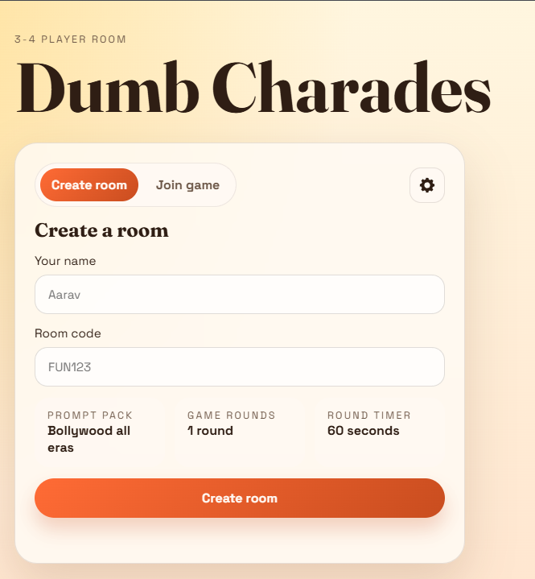
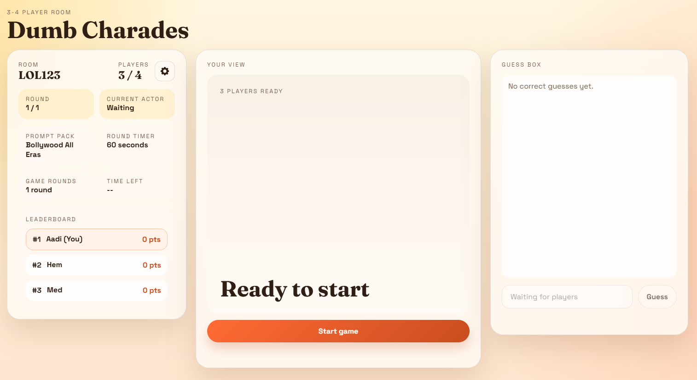
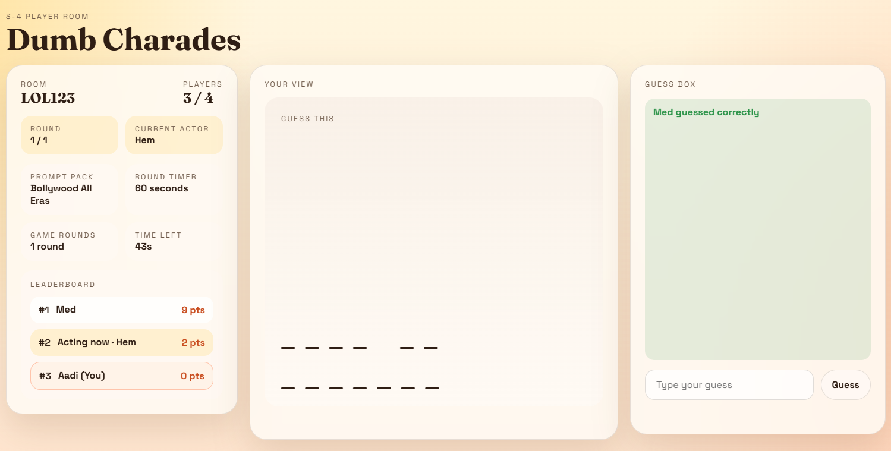
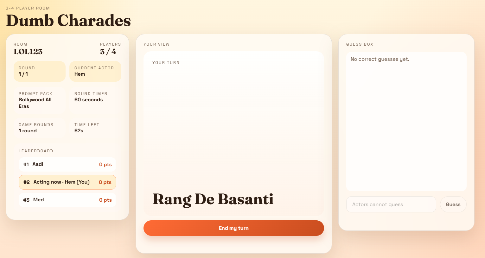
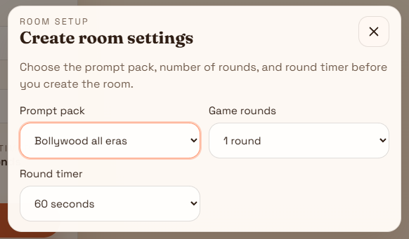

# Dumb Charades 🎭

`Dumb Charades` is a free, self-hosted party game you can deploy for yourself and your friends.

The idea is simple: open the app in a browser, join the same room, and use it as the game coordinator while you talk somewhere else. One player gets the real prompt for their turn, everyone else sees a masked version, and the group can act and guess in real time. If you want voice or video, use something like Google Meet alongside it.

This project is built to be lightweight and easy to run. It does not need accounts, chat moderation systems, video streaming, or a large backend. You host it, share the room code, and play.

<p align="center">
	
</p>

## What the project is for 🎉

This repo exists for people who want:

- A free online dumb charades game they can deploy themselves.
- A private room for friends instead of a public game service.
- A simple web app that handles turn order, timers, prompts, masking, scoring, and room state.
- A base they can fork and adapt into their own party game.

Typical use:

1. Deploy the app somewhere reachable by your group.
2. Start a voice or video call in Google Meet, Discord, Zoom, or any similar tool.
3. Share the game link with your friends.
4. Create a room, join it, and let the app run the game flow while the acting happens over the call.

## What the game does 🕹️

The current version includes:

- 3 to 4 player rooms.
- Create room and join room flow.
- Server-authoritative room state with hidden prompts.
- Multiple prompt packs, including movie and non-movie sets.
- Round timers and configurable number of rounds.
- Guessing, scoring, leaderboard, podium, and replay flow.
- Mobile-friendly browser UI.
- Basic connection-loss and reconnect handling.

<p align="center">
	
</p>

Once the room is full enough to play, the app handles the boring parts for you: turn order, timers, reveal flow, and scoring.

<p align="center">
	
</p>

## How it works 🧠

The app uses a single Node.js server.

- `Express` serves the static frontend.
- `Socket.IO` keeps room state in sync in real time.
- Prompts are selected on the server, not the client, so the active answer stays hidden from other players.
- Room state is stored in memory, which keeps the app simple but also means a server restart clears live rooms.

That tradeoff is intentional: it keeps the project cheap and easy to deploy for casual games with friends.

<p align="center">
	
</p>

That hidden-prompt split is the core trick: the actor sees the real answer, everybody else sees the masked clue. 🤫

## Local setup ⚡

Requirements:

- Node.js
- npm

From the project root:

```bash
npm install
npm start
```

By default, the server runs on port `3000`.

If your hosting environment provides a `PORT` variable, the app uses that automatically.

## Project structure 📦

- `server.js`: Express server, Socket.IO events, room lifecycle, timers, and scoring.
- `movie-datasets.js`: prompt pack definitions.
- `public/index.html`: app shell.
- `public/app.js`: client state rendering and socket interaction.
- `public/styles.css`: desktop and mobile styling.

## Notes and limitations 👀

- This is a friends-only, lightweight app, not a large multiplayer platform.
- Rooms are in memory, so restarts reset active sessions.
- There is no built-in voice or video layer.
- There is no account system or persistence layer.

For most casual groups, that is a feature, not a bug: fewer moving parts, less cost, less maintenance.

## Forking and extending it 🛠️

If you want to fork this and turn it into your own version, this repo is already set up in a way that is easy to modify.

<p align="center">
	
</p>

If you want to add your own flavor, this is the fun part. New packs, different scoring, custom room rules, more chaos, less chaos, whatever fits your group. 😄

### Where to start

If you are extending gameplay, start here:

- `server.js` for room rules, score logic, timers, turn progression, and server validation.
- `movie-datasets.js` for adding, removing, or reorganizing prompt packs.
- `public/app.js` for UI state, button behavior, reconnect handling, and rendering changes.
- `public/styles.css` for layout and visual changes.

### Easy extension ideas

- Add new prompt packs for different groups or themes.
- Add admin controls for room owners.
- Add private custom packs loaded from files or a small database.
- Add text chat or moderation tools.
- Add player avatars or nicknames with stronger validation.
- Add persistence so rooms and scores survive restarts.
- Add a lobby browser or invite links.
- Add support for more players if you are willing to rebalance the UI and game flow.

### Things to understand before changing core logic

- The server is the source of truth. Keep important gameplay rules there.
- Prompt secrecy depends on sending different room payloads to different players.
- Scoring and turn flow are tied to the room lifecycle, so change those paths carefully.
- Because rooms are in memory, persistence work will affect a lot of the lifecycle code.

### A practical extension workflow

1. Fork the repo.
2. Run it locally and play a few rounds so you understand the current flow.
3. Change one layer at a time: datasets, server rules, then UI.
4. Validate after each change with a quick local multiplayer test in multiple browser tabs.
5. Only add persistence or authentication if you actually need them.

If you keep the current architecture in mind, the project is straightforward to evolve.

## General deployment guide 🚀

This section is intentionally platform-agnostic.

### What your host needs to provide

- A Node.js runtime.
- The ability to install npm dependencies.
- The ability to run `npm start`.
- A public URL or IP your friends can reach.
- WebSocket support, because the app uses Socket.IO for live room updates.
- An environment where `PORT` can be assigned by the host or set by you.

### Basic deployment flow

1. Push this repo to your own Git hosting provider.
2. Create a new service on your chosen host.
3. Configure the service to install dependencies with `npm install`.
4. Configure the start command as `npm start`.
5. Make sure the service exposes the port provided by the environment.
6. Deploy and open the public URL.
7. Test with multiple browsers or devices before sharing it widely.

### Deployment checklist

- Confirm `npm install` completes successfully.
- Confirm `npm start` boots the app.
- Confirm the homepage loads over the public URL.
- Confirm multiple players can join the same room.
- Confirm live updates work, which verifies WebSocket support.
- Confirm the app still behaves acceptably after a reconnect.

### Operational expectations

- If the server restarts, live rooms are lost.
- Low-cost hosting is usually enough for small private groups.
- This app is best suited for casual sessions, not always-on production infrastructure.

If you want stronger durability, the next step is adding persistent room storage and a more deliberate reconnect/session model.

## Running games with friends 📞

The simplest real-world setup is:

1. Host this app.
2. Start a Google Meet or similar call.
3. Send both links to your friends.
4. Use the call for acting and reactions.
5. Use this app for prompts, turns, guesses, and scores.

That keeps the app focused on the game while the call handles communication.